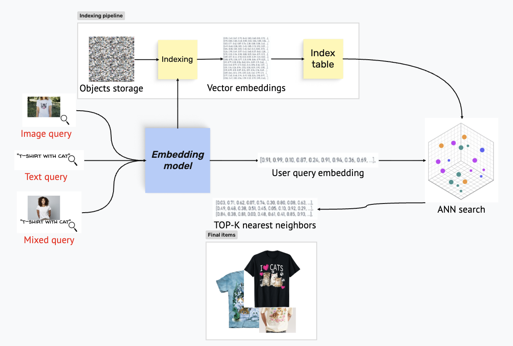

# Схема решения и метрики

## 1) Решение с примером использования

### Схема решения

Для решения задачи поиска похожих товаров по фото разрабатываем сервис мультимодального поиска по товарам Авито. Пользователь хочет найти «футболку с котиком», но в тексте объявлений это редко указывается. Он заходит на веб-страницу сервиса, вводит запрос «футболка с котиком» и нажимает «Искать». Сервис:

1. Токенизирует текст, прогоняет через текстовый энкодер, получает вектор запроса.
2. Обращается к индексу, где хранятся векторы изображений объявлений.
3. Находит top-N ближайших по косинусному расстоянию.
4. По найденным ID подтягивает из таблицы/БД URL-адреса картинок, заголовки объявлений.
5. Возвращает пользователю галерею картинок футболок с котиками, даже если в заголовке написано просто «Футболка женская».

Аналогично работает поиск по изображению: загрузив фото понравившейся пары кед на толстой подошве, пользователь получает все визуально похожие товары.

---

## 2) Бизнес-метрики и их целевые значения

### Основная бизнес-метрика: CTR@10

Click-through Rate в поисковой выдаче, измеренный на уровне запроса.

Если пользователь видит релевантные товары в первом экране (топ-10), он с высокой вероятностью кликнет, что напрямую ведёт к просмотру объявления и потенциальному отклику. Поскольку визуальный поиск внедряется не на пустом месте, а как дополнение к существующему текстовому поиску, то его ценность корректно измерять не абсолютным порогом, а тем, насколько он увеличивает кликабельность выдачи у тех пользователей, которые сталкиваются с проблемой «не могу описать словами».

**Способ расчёта:** Проводится A/B-эксперимент: контрольная группа видит результаты обычного текстового поиска по заголовкам и описаниям, тестовая группа — дополнительно получает возможность искать картинкой или текстом по картинкам.

Для каждого пользовательского запроса считается, был ли совершён хотя бы один клик по любому из первых 10 результатов выдачи. Итоговый CTR@10 — доля запросов, в которых такой клик состоялся:

$$CTR@10 = \frac{\text{число запросов с} \geq 1 \text{ кликом в топ-10}}{\text{общее число запросов}}$$

Далее сравниваются средние CTR@10 в группах.

**Целевое значение:** Прирост (тестовая группа минус контрольная) CTR@10 > **5–10%**. Если прирост < 5%, эффект от визуального поиска слишком мал, чтобы оправдать затраты на разработку и поддержку.

### Дополнительная бизнес-метрика: Adoption Rate

Доля пользователей, воспользовавшихся фичей.

Сам по себе рост CTR может быть достигнут за счёт небольшой, но очень лояльной аудитории. Чтобы убедиться, что фича действительно востребована, необходимо отслеживать, какая доля пользователей вообще пробует новый тип поиска.

**Способ расчёта:**

$$Adoption\ Rate = \frac{\text{число уникальных пользователей с} \geq 1 \text{ визуальным/кросс-модальным запросом за период}}{\text{общее число уникальных пользователей в целевых категориях за тот же период}}$$

**Целевое значение:** Adoption Rate > **5%** в первый месяц после запуска, с ростом до **10–15%** через квартал. Такой уровень подтверждает, что функция естественно встраивается в поведение пользователей, а не остаётся нишевым инструментом.

---

## 3) Метрики машинного обучения, отражающие бизнес-метрику

Для офлайн-оценки качества модели и ранжирования используем три взаимодополняющие метрики, рассчитываемые на размеченном датасете запросов с известными релевантными товарами:

### Recall@10

Доля всех релевантных товаров в базе, попавших в топ-10 выдачи.

$$Recall@10 = \frac{\text{релевантные товары в топ-10}}{\text{все релевантные товары для запроса}}$$

Высокий Recall@10 гарантирует, что большинство подходящих товаров не теряются, максимизируя шанс пользователя найти нужное. Прямо коррелирует с CTR — чем больше релевантных товаров в поле зрения, тем выше вероятность клика.

### Precision@10

Доля релевантных товаров среди первых 10 результатов.

$$Precision@10 = \frac{\text{релевантные товары в топ-10}}{10}$$

Precision@10 контролирует «чистоту» выдачи. Если в топ-10 попадает много нерелевантного мусора, пользователь разочаровывается и не кликает — CTR падает.

### MRR (Mean Reciprocal Rank)

Среднее арифметическое обратных рангов первого релевантного документа в выдаче по всем запросам.

$$MRR = \frac{1}{|Q|} \cdot \sum_{i} \frac{1}{rank_i}$$

где $rank_i$ — позиция первого релевантного товара для i-го запроса.

MRR чувствителен к положению самого первого релевантного результата. Чем выше первый релевантный товар, тем быстрее пользователь замечает его и кликает. Улучшение MRR прямо способствует росту CTR@10.

MRR используется как дополнительный критерий для сравнения вариантов ранжирования. Все три метрики замеряются на одном и том же тестовом наборе запросов.
