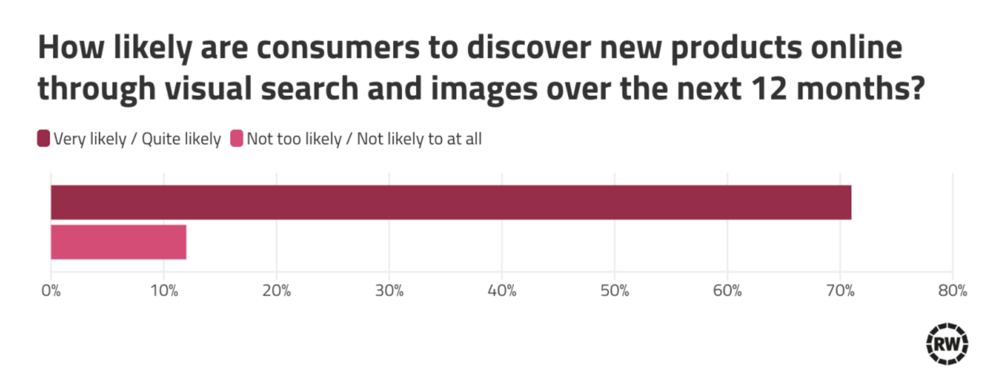

# Поиск по картинке / поиск на картинках. Оценка проекта до взятия в работу

## 1) Оценка потенциала проекта. Как часто возникает проблема? Оценка экономического эффекта

**Проблема:** пользователи маркетплейсов и интернет-магазинов не могут найти нужный товар через текстовый поиск, потому что не знают, как его описать словами. Они видели предмет вживую, на фото в соцсетях, в фильме или у знакомых — но не знают ни бренда, ни названия, ни правильной категории.

Некоторые цифры:
- **52% покупателей** затрудняются описать словами то, что ищут (Pinterest & Retail Week, опрос 1 000 покупателей в Великобритании, 2025)
- **>85% онлайн-покупателей** считают визуальную информацию более важной, чем текстовую при покупке одежды или мебели (Shopify, 2023)

[(Pinterest & Retail Week, опрос 1 000 покупателей в Великобритании, 2025)](https://www.retail-week.com/customer/exclusive-research-1000-shoppers-reveal-the-new-ways-they-discover-brands/7048966.article#:~:text=Nearly%20three%2Dquarters%20of%20all,25%20to%2034%20year%2Dolds.)

С точки зрения экономического эффекта, ожидается рост конверсии и рост просмотров товаров за сессию. В перспективе — снижение операционных расходов на каталогизацию и снижение возвратов.

---

## 2) Есть ли простое решение?

Ключевая ценность визуального поиска — возможность искать картинкой по каталогу или текстом по изображениям. Простые решения (поиск по ключевым словам, BM25, фильтры по атрибутам) принципиально не способны уловить семантику запроса, если она расходится с тем, что написал продавец. Такие запросы требуют кросс-модального понимания, модель должна сопоставить текст именно с тем, что изображено на фото, а не с тем, что написал продавец.

Типичные случаи, где текстовый поиск не работает:

- Когда важная деталь присутствует только на изображении (например, принт на одежде — «футболка с котиком»)
- Когда запрос описывает форму или фасон, который продавец не указал (например, «платье с рукавом-фонариком»)
- Когда используются визуальные или субъективные характеристики (например, «кеды на толстой подошве», «oversize»)

**Вывод:** Во всех примерах проблема одинакова: релевантная информация присутствует на изображении, но отсутствует в текстовых данных. Это делает текстовый поиск неполным. Задача требует ML-подхода.

---

## 3) Реалистичность решения с помощью ML

Существуют десятки успешных продуктов, использующих визуальный поиск: Pinterest Lens, Google Lens, ASOS Style Match, Amazon StyleSnap. Один из основных подходов — мультимодальная модель, реализующая контрастивный лосс. Контрастивная функция потерь притягивает друг к другу эмбеддинги запроса и позитивного примера, в то же самое время отталкивая эмбеддинги негативных примеров; тем самым она реализует единое векторное пространство для картинок и текстов. Такая сеть будет способна ранжировать по метрике схожести визуальные и текстовые концепции.

### Query Pipeline

- Изображение -> CLIP/SigLIP -> Embedding (768–1024d)
- Текст -> CLIP/SigLIP -> Embedding (768–1024d)

### ANN Index

- 1M+ товарных эмбеддингов, предрассчитанных офлайн
- Approximate Nearest Neighbor search, top-K
- Опционально — Re-ranker (кросс-энкодер или согласно бизнес-правилам: цена, наличие и т.д.)

---

## 4) Технические требования

Сервис должен отвечать за **< 1 сек** и держать нагрузку **1 rps**. Конечные технические требования очень сильно зависят от архитектурных решений:

- Размерность эмбеддингов
- Выбор реализации ANN
- Стратегия квантования
- Размер выбранной модели
- Наличие и выбор ре-ранкера
