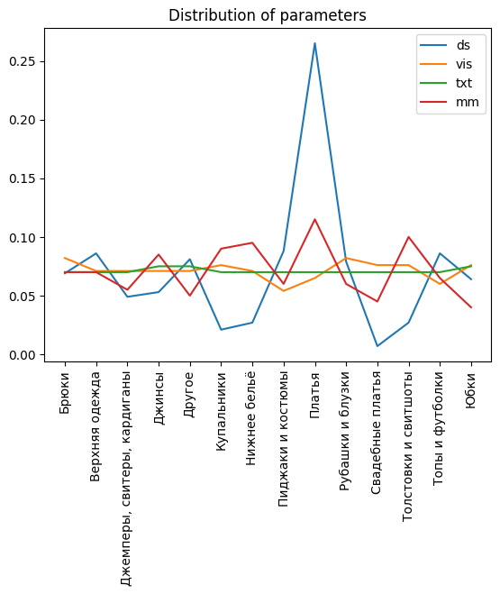
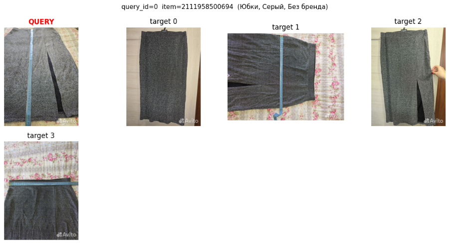
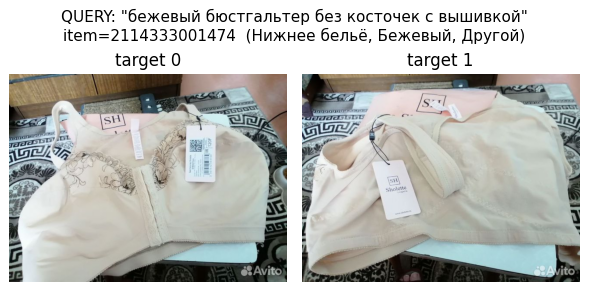
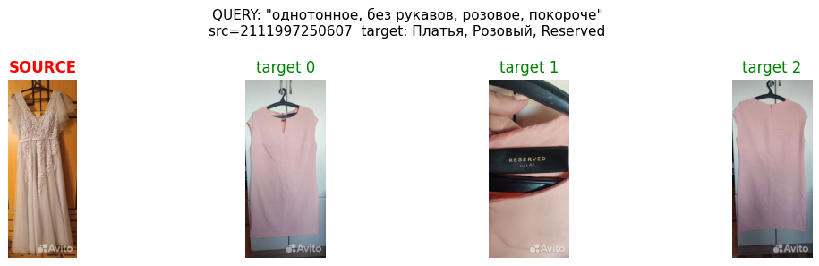

# Validation Dataset

## Файлы

| File | Mode | N Rows | Description |
|---|---|--------|---|
| `val_dataset.csv` | all | 583    | Combined dataset (vis + txt + multimodal) |
| `val_dataset_vis.csv` | image | 184    | Visual search: query image -> target images |
| `val_dataset_txt.csv` | txt | 199    | Text search: text query -> target images |
| `val_dataset_multimodal.csv` | multimodal | 200    | Multimodal: source image + text modifier -> target images |

`+ val_dataset.py for evaluating and calculate metrics`
## Столбцы val_ds

| Column | Type | Description                                                                  |
|---|---|------------------------------------------------------------------------------|
| `query_id` | int | query id                                                                     |
| `mode` | str | `image` / `txt` / `multimodal`                                               |
| `item_id` | int | Source item ID                                                               |
| `image_id` | int | ID запросного изображения (title image для txt/multimodal, random для image) |
| `image_path` | str | Относительный путь до query image (`dataset_1M/...`)                         |
| `txt_query` | str\|NaN | Текстовый запрос(NaN для img search)                                         |
| `target_images_id` | str | Ids таргетных изображений(sep - ;)                                           |
| `param2` | str | Подкатегория                                                                 |
| `category_name` | str | Категория                                                                    |
| `sostoyanie` | str | Сост.                                                                        |
| `cvet` | str | Цвет                                                                         |
| `brand` | str | Бренд                                                                        |

## Стратегии поиска

**image** — user provides a query image, system returns visually similar items.
Query = `image_path`, targets = `target_images_id`.

**txt** — user types a text query, system returns matching items.
Query = `txt_query`, targets = `target_images_id`.

**multimodal** — user provides a reference image + text describing desired changes.
Query = `image_path` + `txt_query`, targets = `target_images_id`.

## Распределение по категориям

Датасет создавался с сохранением баланса по категориям, в дальнейшем есть возможность посчитать micro / macro metrics, в т.ч. усредняя с весами на каждую категорию согласно частоте категории

## Примеры в каждой стратегии поиска

1. ПОИСК ИЗОБРАЖЕНИЕМ

2. ПОИСК ТЕКСТОМ

3. ПОИСК МУЛЬТИМОДАЛЬНЫЙ

